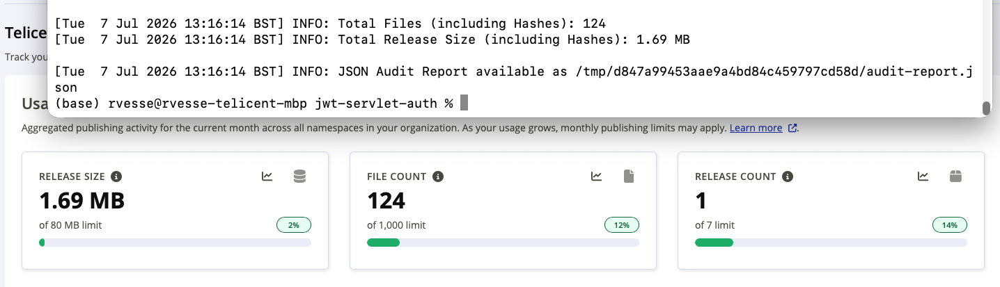

# Maven Central Audit

With the incoming enforcement of Maven Central publisher usage limits many publishers, including Telicent, are having to
figure out whether they can be more efficient in what they publish to Maven Central to reduce their usage. The script in
this repository is designed to audit Maven projects to analyse what they would release and highlight any obvious
problems.

It can be run [directly](#run-directly) or as a [GitHub Action](#run-as-an-action).

Please see [Outputs](#outputs) for example output.

# Requirements

The following tools are required to be present on your `PATH`:

- `mvn`
- `xidel` - this is used to apply XPath expressions to effective module POM files to
  help determine some release/plugin configurations
- `jq` - this is used to help prepare the JSON [audit report](#outputs)

Additionally the script requires on various standard POSIX commands and/or Bash built-ins.  The script will exit
immediately if any of the required commands are not found.

# Run Directly

Assuming you have first `git clone`'d this repository and added the working copy directory to your `PATH` then from a
Maven project directory simply run `audit.sh` e.g.

```bash
audit.sh
```

## Run Options

A single command line parameter is supported to indicate which [Step](#steps) of the audit process you wish to resume
from e.g.

```bash
audit.sh 4
```

## Environment Variables

- `TMPDIR` - If set this is used as the base of the [Output Directory](#outputs)
- `OUTPUT_DIR` - If set this is used as the output directory ignoring `TMPDIR`
- `MAVEN_ARGS` - If set adds additional arguments to the `mvn` commands run in [Steps](#steps) 3 and 6, this may be
  useful if your build/release requires specific profile(s) to be activated or Maven properties to be customised

> You **MUST NOT** set `OUTPUT_DIR` to a directory within the Maven project directory you are trying to audit, otherwise
> some of the `mvn` commands run may wipe this directory unexpectedly and cause script failures.

# Run as an Action

This repository also contains a composite GitHub Action that may be run, the action assumes the following things:

- Your workflow has checked out the Maven project repository you wish to run the action against
- Your workflow has already setup Java and Maven appropriately
- Your workflow has imported a GPG Key pair for code signing, OR your project does not enable GPG signing by default.

## Action Usage

```yaml
      - name: Run Maven Central Audit
        uses: Telicent-io/mvn-central-audit@v1
```

This will install the necessary supporting tools and obtain the `audit.sh` script before running the audit.  The audit
may fail if the script fails (see [Exit Codes](#exit-codes)), or if the produced audit report indicates that the number
of release files/total release size exceeds the default [limits](#action-inputs)

### Action Inputs

The action supports the following inputs:

| Input             | Required?  | Default   | Purpose                                                   |
|-------------------|------------|-----------|-----------------------------------------------------------|
| `max-files`       | `false`    | `100`     | Specifies the maximum permitted number of release files   |
| `max-size`        | `false`    | `8000000` | Specifies the maximum size in bytes of the release files  |
| `max-warnings`    | `false`    | `-1`      | Specifies the maximum number of published module warnings |
| `artifact-suffix` | `false`    |           | Specifies a suffix for the uploaded audit report artifact |

#### Limits

The `max-files` and `max-size` inputs specify limits that are imposed on the audited release, if the audit report
indicates a release of your Maven project would exceed these then GitHub Actions errors are reported and the action will
fail.

The defaults for these limits are set at 10% of the current proposed monthly usage limits for Maven Central.

Setting either limit to `0` or a negative value will disable that limit being enforced.  We would recommend running the
audit [directly](#run-directly) against your Maven projects before adopting usage of this action.  That way you can
address any obvious issues up front and configure appropriate limits for your project.

The `max-warnings` input specifies the limit on the number of warnings, as reported by the top level `warnings` property
in the audit report.  Unlike the other limits this may be set to `0` to indicate you permit no warnings, a negative
value disables this limit.

#### Artifact Suffix

The action will upload an artifact named `maven-central-audit` for your build, you can optionally add a suffix to this
name by specifying the `artifact-suffix` input.  This may be useful if you have a job matrix that results in calling
this action multiple times as otherwise the artifacts would conflict.

# What it does

The script runs an 8 step audit process, the outputs of each step are written to a temporary directory under
`/tmp/<hash>` where `<hash>` is the `md5` hash of the directory you are running the script against i.e. each unique
Maven project directory you run this script against has unique isolated outputs.  This means the script can be run
against many Maven project directories safely in parallel.

## Steps

The steps are as follows:

1. Validates that you are in a Maven project directory i.e. there is a `pom.xml` file present
2. Validates that the `pom.xml` file is configured to use the Maven Central publishing plugin
3. Quick builds the Maven project (`mvn clean install`) with various skip flags set to skip over time consuming steps.
   This step mainly serves to validate that the project is minimally buildable.
4. Determines the list of Maven modules in the project
5. Determines which of those Maven modules are actually published i.e. those that don't set the `skipPublishing`
   property/configuration for the Maven central publishing plugin to `true`
6. Does a dry-run of `mvn deploy`.  Since the Maven Central publishing plugin doesn't have a dry-run mode we achieve
   this by disabling `autoPublish` and setting a fake `centralBaseUrl` (pointing at `localhost`) so it doesn't
   accidentally create a deployment on Maven Central
7. Determines the prepared bundle directories for each published module
8. Audits each published module
9. Produce the final audit report

Note that each step produces outputs to the aforementioned temporary directory as appropriate, therefore the script
allows you to skip checks if you make changes based on the audit report that don't require you to re-run the entire
script.  To do this supply the desired starting step as an argument to this script e.g. `audit.sh 5` restarts from the
published module detection step if you had made some changes to skip publishing certain modules.

## Audit Checks

For each published module the following audit checks are carried out:

- Counts the number of release files, and sums the total size in bytes, of the release files for the module
- If a module produces more than 4MB of release files then lists the top 5 largest files for the module
    - Checks whether the Maven Shade plugin is being used and if so issues a warning that the module may be producing a
      fat JAR.  Fat JARs should avoid being published to Maven Central unless there's a strong reason to do so.
- If a module produces a `tests` and/or `test-sources` JAR(s) checks whether the modules `tests` classifier is used as a
  dependency of other modules in the project.
    - If not used as an internal project dependency issues warnings as these JARs are unnecessary **UNLESS** they
       contain reusable test code you expect downstream consumers outside your project to reuse.
- If a module produces CycloneDX SBOMs checks whether multiple SBOM formats are being produced.
    - If so issues a warning since SBOMs will contain the same data and no need to publish multiple formats to Maven
      Central
- If the Central Publishing plugin is configured with `<checksums>none</checksums>` and the module does not produce any
  checksum files then a warning is issued

Once these have run on all modules a summary is also printed showing the total number of release files and total release
size in bytes.

## Audit Summary

Finally the audit script calculates how many additional hash files will need to be published with the release and how
large those would be.

If your project is configured to produce all checksum formats then a warning will be issued suggesting that you
configure the Maven Central publishing plugin to only publish `required` checksums to reduce total number of release
files.

Similarly if the plugin is configured with `none` checksums then the script assumes your build produces those checksums
and they will already be accounted for in the report total release files and sizes.

## Outputs

As already noted various output files are by default produced to a temporary directory named `/tmp/<hash>` where
`<hash>` is the MD5 hash of the Maven project directory the script is run against.  This can be customised via
[environment variables](#environment-variables).  You can manually inspect the files in this directory if you wish to
understand more about how the audit script works, and how each step records some calculated information to allow
subsequent steps to proceed from that recording state without re-running the whole audit each time.

For most users the script producing human readable logging output about it's progress and findings which should be
informative, e.g., output for a local clone of our https://github.com/telicent-oss/jena-fuseki-kafka repository:

```
[Tue  7 Jul 2026 11:46:27 BST] INFO: Temporary Output Files will be written to /tmp/a89b9a8ec02b4448581d052334e8de81/

[Tue  7 Jul 2026 11:46:27 BST] INFO: Step 1: Validate Maven Project Directory
[Tue  7 Jul 2026 11:46:27 BST] INFO: Validated that current directory is a Maven project directory

[Tue  7 Jul 2026 11:46:27 BST] INFO: Step 2: Validate Maven Central Publishing Plugin used
[Tue  7 Jul 2026 11:46:29 BST] INFO: Validated that Maven project uses Maven Central publishing plugin

[Tue  7 Jul 2026 11:46:29 BST] INFO: Step 3: Quick Building the Maven Project
[Tue  7 Jul 2026 11:46:29 BST] INFO: Quick building the Maven Project (skipping tests, GPG signing, CycloneDX SBOMs, Javadoc, Source and Delombok)
[Tue  7 Jul 2026 11:46:42 BST] INFO: Maven project quick builds OK

[Tue  7 Jul 2026 11:46:42 BST] INFO: Step 4: Determining Maven Modules
[Tue  7 Jul 2026 11:46:42 BST] INFO: Detecting Maven Modules...
[Tue  7 Jul 2026 11:46:45 BST] INFO: Found 4 Maven modules in this project

[Tue  7 Jul 2026 11:46:45 BST] INFO: Step 5: Determining which Maven Modules are Published
[Tue  7 Jul 2026 11:46:45 BST] INFO: Checking whether Maven Module jena-kafka is published to Maven central...
[Tue  7 Jul 2026 11:46:48 BST] INFO: Maven Module jena-kafka is published to Maven Central
[Tue  7 Jul 2026 11:46:48 BST] INFO: Checking whether Maven Module jena-kafka-connector is published to Maven central...
[Tue  7 Jul 2026 11:46:52 BST] INFO: Maven Module jena-kafka-connector is published to Maven Central
[Tue  7 Jul 2026 11:46:52 BST] INFO: Checking whether Maven Module jena-fuseki-kafka-module is published to Maven central...
[Tue  7 Jul 2026 11:46:56 BST] INFO: Maven Module jena-fuseki-kafka-module is published to Maven Central
[Tue  7 Jul 2026 11:46:56 BST] INFO: Checking whether Maven Module jena-fmod-kafka is published to Maven central...
[Tue  7 Jul 2026 11:47:00 BST] WARN: Detected Maven Module jena-fmod-kafka skips publishing to Maven Central
[Tue  7 Jul 2026 11:47:00 BST] INFO: 3/4 modules are published to Maven Central
[Tue  7 Jul 2026 11:47:00 BST] INFO: Maven Project will generate 2 hash files per release file

[Tue  7 Jul 2026 11:47:00 BST] INFO: Step 6: Maven Deploy Dry Run
[Tue  7 Jul 2026 11:47:00 BST] INFO: Dry running mvn deploy (with tests skipped) to audit publishing bundle files...
[Tue  7 Jul 2026 11:47:27 BST] INFO: Dry ran mvn deploy

[Tue  7 Jul 2026 11:47:27 BST] INFO: Step 7: Determining Bundle directories
[Tue  7 Jul 2026 11:47:29 BST] INFO: Maven Module jena-kafka has bundle directory target/central-deferred/io/telicent/jena/jena-kafka/3.0.5-SNAPSHOT/
[Tue  7 Jul 2026 11:47:31 BST] INFO: Maven Module jena-kafka-connector has bundle directory target/central-deferred/io/telicent/jena/jena-kafka-connector/3.0.5-SNAPSHOT/
[Tue  7 Jul 2026 11:47:33 BST] INFO: Maven Module jena-fuseki-kafka-module has bundle directory target/central-deferred/io/telicent/jena/jena-fuseki-kafka-module/3.0.5-SNAPSHOT/

[Tue  7 Jul 2026 11:47:34 BST] INFO: Step 8: Auditing Maven Central bundles

[Tue  7 Jul 2026 11:47:34 BST] INFO: Auditing Maven Central bundle for Maven Module jena-kafka...
[Tue  7 Jul 2026 11:47:34 BST] INFO: Maven Module jena-kafka publishes 4 release files
[Tue  7 Jul 2026 11:47:34 BST] INFO: Maven Module jena-kafka publishes 317.53 KiB bytes of release files
[Tue  7 Jul 2026 11:47:34 BST] INFO: Preparing JSON report for module...
[Tue  7 Jul 2026 11:47:34 BST] INFO: Maven Module jena-kafka audit complete

[Tue  7 Jul 2026 11:47:34 BST] INFO: Auditing Maven Central bundle for Maven Module jena-kafka-connector...
[Tue  7 Jul 2026 11:47:34 BST] INFO: Maven Module jena-kafka-connector publishes 10 release files
[Tue  7 Jul 2026 11:47:34 BST] INFO: Maven Module jena-kafka-connector publishes 387.63 KiB bytes of release files
[Tue  7 Jul 2026 11:47:34 BST] INFO: Preparing JSON report for module...
[Tue  7 Jul 2026 11:47:34 BST] INFO: Maven Module jena-kafka-connector audit complete

[Tue  7 Jul 2026 11:47:34 BST] INFO: Auditing Maven Central bundle for Maven Module jena-fuseki-kafka-module...
[Tue  7 Jul 2026 11:47:34 BST] INFO: Maven Module jena-fuseki-kafka-module publishes 12 release files
[Tue  7 Jul 2026 11:47:34 BST] INFO: Maven Module jena-fuseki-kafka-module publishes 498.38 KiB bytes of release files
[Tue  7 Jul 2026 11:47:37 BST] WARN: Maven Module jena-fuseki-kafka-module publishes a tests classifier JAR that is not used as a dependency within this project, if this is not required by downstream consumers consider skipping test-jar packaging for this module
[Tue  7 Jul 2026 11:47:37 BST] INFO: Preparing JSON report for module...
[Tue  7 Jul 2026 11:47:37 BST] INFO: Merging warnings into JSON report
[Tue  7 Jul 2026 11:47:37 BST] INFO: Maven Module jena-fuseki-kafka-module audit complete

[Tue  7 Jul 2026 13:18:13 BST] INFO: Maven Project publishes 26 release files
[Tue  7 Jul 2026 13:18:13 BST] INFO: Maven Project publishes 1.23 MB bytes of release files
[Tue  7 Jul 2026 13:18:13 BST] INFO: An additional 26 hash files will also be published
[Tue  7 Jul 2026 13:18:13 BST] INFO: Hash files will add an additional 1.87 KB bytes of hash files

[Tue  7 Jul 2026 13:18:13 BST] INFO: Total Files (including Hashes): 52
[Tue  7 Jul 2026 13:18:13 BST] INFO: Total Release Size (including Hashes): 1.23 MB

[Tue  7 Jul 2026 11:47:37 BST] INFO: JSON Audit Report available as /tmp/a89b9a8ec02b4448581d052334e8de81/audit-report.json

```

### Audit Report JSON

As seen at the end of the example log output it also prepares an `audit-report.json` file that contains a summary of
the audit.

The report starts with summary information:

- `releaseFiles` - How many release files will be published by a release (excluding hash files)
- `releaseFilesSize` - Total size in bytes of the release files (excluding hash files)
- `hashFiles` - How many hash files will be published by a release
- `hashFilesSize` - Total size in bytes of the hash files for the release
- `totalFiles` - Total number of release files a release will generate including `hashFiles`
- `totalSize` - Total size in bytes that a release will generate including `hashFilesSize`
- `warnings` - Total number of warnings reported across all published modules

It then goes into detailed per-module reports, each item in the `modules` array contains the following:

- `module` - The name of the module
- `files` - An array of objects each representing a single release file, the array is sorted from largest to smallest
  file:
    - `file` - Indicates the name of a release file
    - `size` - Indicates the size in bytes of the release file
    - `classifier` - Indicates the Maven classifier of a release file, this will be `signature` for the signature files
    - `type` - Indicates the file extension for the release file
- `warnings` - An optional field, if present it is an array of warning messages indicating any potential issues with the
  module that you may wish to address

Finally it provides a `classifiers` array that summarises the artifacts by their Maven classifier, this array is sorted
from the classifier that produces the most bytes of release files to the fewest.  Each item in the `classifiers` array
contains the following:

- `classifier` - The Maven classifier
- `size` - The total size in bytes of release files with this classifier
- `files` - The number of files with this classifier

Here's an example audit report:

```json
{
  "releaseFiles": "26",
  "releaseFilesSize": "1232445",
  "hashFiles": "26",
  "hashFilesSize": "1872",
  "totalFiles": "52",
  "totalSize": "1234317",
  "warnings": "1",
  "modules": [
    {
      "module": "jena-fuseki-kafka-module",
      "files": [
        {
          "file": "jena-fuseki-kafka-module-3.0.5-SNAPSHOT-cyclonedx.json",
          "size": "284106",
          "classifier": "cyclonedx",
          "type": "json"
        },
        {
          "file": "jena-fuseki-kafka-module-3.0.5-SNAPSHOT-javadoc.jar",
          "size": "124285",
          "classifier": "javadoc",
          "type": "jar"
        },
        {
          "file": "jena-fuseki-kafka-module-3.0.5-SNAPSHOT-tests.jar",
          "size": "45270",
          "classifier": "tests",
          "type": "jar"
        },
        {
          "file": "jena-fuseki-kafka-module-3.0.5-SNAPSHOT.jar",
          "size": "23946",
          "classifier": "jar",
          "type": "jar"
        },
        {
          "file": "jena-fuseki-kafka-module-3.0.5-SNAPSHOT-sources.jar",
          "size": "18530",
          "classifier": "sources",
          "type": "jar"
        },
        {
          "file": "jena-fuseki-kafka-module-3.0.5-SNAPSHOT.pom",
          "size": "9212",
          "classifier": "pom",
          "type": "pom"
        },
        {
          "file": "jena-fuseki-kafka-module-3.0.5-SNAPSHOT-cyclonedx.json.asc",
          "size": "833",
          "classifier": "signature",
          "type": "asc"
        },
        {
          "file": "jena-fuseki-kafka-module-3.0.5-SNAPSHOT-javadoc.jar.asc",
          "size": "833",
          "classifier": "signature",
          "type": "asc"
        },
        {
          "file": "jena-fuseki-kafka-module-3.0.5-SNAPSHOT-sources.jar.asc",
          "size": "833",
          "classifier": "signature",
          "type": "asc"
        },
        {
          "file": "jena-fuseki-kafka-module-3.0.5-SNAPSHOT-tests.jar.asc",
          "size": "833",
          "classifier": "signature",
          "type": "asc"
        },
        {
          "file": "jena-fuseki-kafka-module-3.0.5-SNAPSHOT.jar.asc",
          "size": "833",
          "classifier": "signature",
          "type": "asc"
        },
        {
          "file": "jena-fuseki-kafka-module-3.0.5-SNAPSHOT.pom.asc",
          "size": "833",
          "classifier": "signature",
          "type": "asc"
        }
      ],
      "warnings": [
        "Publishes a tests classifier JAR that is not used as a dependency within this project.  If not required by downstream consumers consider skipping test-jar packaging for this module"
      ]
    },
    {
      "module": "jena-kafka-connector",
      "files": [
        {
          "file": "jena-kafka-connector-3.0.5-SNAPSHOT-javadoc.jar",
          "size": "169395",
          "classifier": "javadoc",
          "type": "jar"
        },
        {
          "file": "jena-kafka-connector-3.0.5-SNAPSHOT-cyclonedx.json",
          "size": "129641",
          "classifier": "cyclonedx",
          "type": "json"
        },
        {
          "file": "jena-kafka-connector-3.0.5-SNAPSHOT.jar",
          "size": "45509",
          "classifier": "jar",
          "type": "jar"
        },
        {
          "file": "jena-kafka-connector-3.0.5-SNAPSHOT-sources.jar",
          "size": "38745",
          "classifier": "sources",
          "type": "jar"
        },
        {
          "file": "jena-kafka-connector-3.0.5-SNAPSHOT.pom",
          "size": "9483",
          "classifier": "pom",
          "type": "pom"
        },
        {
          "file": "jena-kafka-connector-3.0.5-SNAPSHOT-cyclonedx.json.asc",
          "size": "833",
          "classifier": "signature",
          "type": "asc"
        },
        {
          "file": "jena-kafka-connector-3.0.5-SNAPSHOT-javadoc.jar.asc",
          "size": "833",
          "classifier": "signature",
          "type": "asc"
        },
        {
          "file": "jena-kafka-connector-3.0.5-SNAPSHOT-sources.jar.asc",
          "size": "833",
          "classifier": "signature",
          "type": "asc"
        },
        {
          "file": "jena-kafka-connector-3.0.5-SNAPSHOT.jar.asc",
          "size": "833",
          "classifier": "signature",
          "type": "asc"
        },
        {
          "file": "jena-kafka-connector-3.0.5-SNAPSHOT.pom.asc",
          "size": "833",
          "classifier": "signature",
          "type": "asc"
        }
      ]
    },
    {
      "module": "jena-kafka",
      "files": [
        {
          "file": "jena-kafka-3.0.5-SNAPSHOT-cyclonedx.json",
          "size": "292859",
          "classifier": "cyclonedx",
          "type": "json"
        },
        {
          "file": "jena-kafka-3.0.5-SNAPSHOT.pom",
          "size": "30635",
          "classifier": "pom",
          "type": "pom"
        },
        {
          "file": "jena-kafka-3.0.5-SNAPSHOT-cyclonedx.json.asc",
          "size": "833",
          "classifier": "signature",
          "type": "asc"
        },
        {
          "file": "jena-kafka-3.0.5-SNAPSHOT.pom.asc",
          "size": "833",
          "classifier": "signature",
          "type": "asc"
        }
      ]
    }
  ],
  "classifiers": [
    {
      "classifier": "cyclonedx",
      "size": 706606,
      "files": 3
    },
    {
      "classifier": "javadoc",
      "size": 293680,
      "files": 2
    },
    {
      "classifier": "jar",
      "size": 69455,
      "files": 2
    },
    {
      "classifier": "sources",
      "size": 57275,
      "files": 2
    },
    {
      "classifier": "pom",
      "size": 49330,
      "files": 3
    },
    {
      "classifier": "tests",
      "size": 45270,
      "files": 1
    },
    {
      "classifier": "signature",
      "size": 10829,
      "files": 13
    }
  ]
}
```

### Exit Codes

1. If a required command is missing then it exits with a `126` status
2. If the script is interrupted (by `SIGINT`, `SIGQUIT` or `SIGTERM`) then it exits with a `127` status
    - For other non-catchable signals that abort the script the exit status will be non-zero but may depend on the OS
3. If a [Step](#steps) fails then it will exit with the step number as the status, e.g. `3` if the Quick Maven Build
step failed.
4. If the script runs successfully then it exits with a `0` status.

### How accurate is this?

The script has been designed to be as accurate as possible, for example here's an audit on another of our open source
repositories compared with usage report on Maven Central:



> *NB* From our testing it appears that Maven Central Usage reports uses metric units when converting reported Release
> Size into human readable format.  Therefore wherever this script reports a human readable size it uses this convention
> for the conversion.

However, the script relies on some introspection of Maven `help:effective-pom` files via XPath, Maven property
evaluation (via `exec:exec`) and inspecting the Central Publishing Plugins temporary staging directories.  Therefore
it's possible it may not correctly identify all published modules and release files correctly depending on your Maven
project.

Also since the Maven Central usage report does not provide fine-grained data you can only really do this comparison by
observation of a single known release at the start of the monthly reporting period (bearing in mind that Maven Central
usage only updates once per 24 hours!).

# Contributing

We welcome PRs that improve the accuracy/efficiency of this script, or add additional audit checks based on issues it's
helped you identify in your Maven projects that are not currently flagged as warnings.

# License

This is open source code under the [Apache License 2.0](LICENSE), please see [NOTICE](NOTICE) for Copyright Notices.